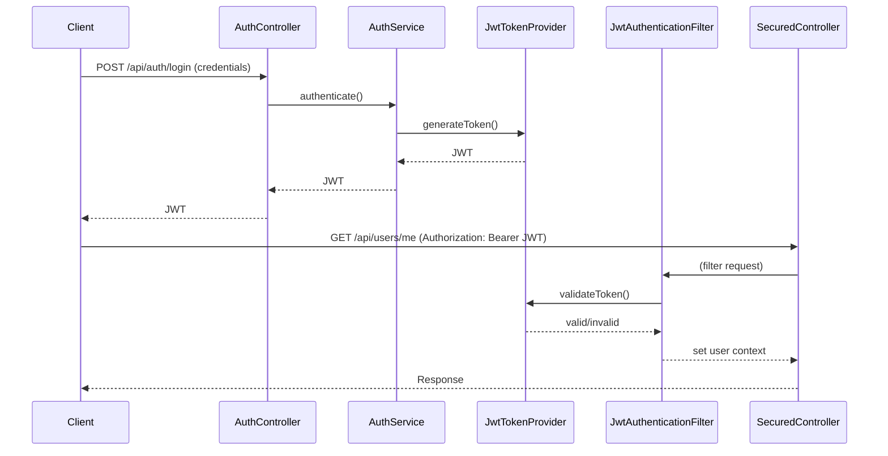

Project Structure
First, let's create the basic project structure:
buizzment/
├── src/
│   ├── main/
│   │   ├── java/com/buizzment/
│   │   │   ├── config/
│   │   │   ├── controller/
│   │   │   ├── dto/
│   │   │   ├── model/
│   │   │   ├── repository/
│   │   │   ├── security/
│   │   │   ├── service/
│   │   │   └── BuizzmentApplication.java
│   │   └── resources/
│   │       ├── application.properties
│   │       └── application-dev.properties
│   └── test/
└── pom.xml

POST /api/auth/signup
Content-Type: application/json

{
"name": "John Doe",
"username": "johndoe",
"email": "john@example.com",
"password": "password123"
}

POST /api/auth/signin
Content-Type: application/json

{
"usernameOrEmail": "johndoe",
"password": "password123"
}

GET /api/test/user
Authorization: Bearer <token-from-signin>

sequenceDiagram
Client->>+Server: GET /api/test/user (with JWT)
Server->>+JwtFilter: Extract/validate token
JwtFilter->>+UserDetailsService: Load user by ID
UserDetailsService->>+Database: Get user + roles
Database-->>-UserDetailsService: User data
UserDetailsService-->>-JwtFilter: UserPrincipal with authorities
JwtFilter->>+SecurityContext: Store authentication
SecurityContext-->>-JwtFilter: Confirm
JwtFilter->>+Controller: Forward request
Controller->>+Security: Check @PreAuthorize
Security-->>-Controller: Authorization result
Controller-->>-Client: Response

{
"name": "Sudhanshu",
"username": "Sudhanshu",
"email": "Sudhanshu@example.com",
"password": "password123",
"roles": "ADMIN"
}

## 7. Summary Diagram

https://mermaid.live/edit#pako:eNqNVF1vmzAU_SvWfUqlNHw6IX6otGUfUl9WLZEmTbxYcEutgs2MybpG-e8zhC0kcbb6BWyfc-65x4YdZCpHYEDsaPBHizLDD4IXmlepJMOouTYiEzWXhqxKgdK499615mmlpNGqLFFfx6xRb0WGbsD9T7NRzygftNqK_JqMRXVK1orIuBFKfhKluQZeY9ZqzMfWjsBDQ7d3d6fuGXn4st4Qj9fC43bHK1UhJJlkVqirysvm5ihyyh3EhjYZ4UenODljDSBLOW-ckQIlasvpl8fEc-jtecX7bxt3GUefF9hRIxZ-yGeAOWK7CJeRzx-H4NoGdeNVSCadrtLitT8rRt4j16g7zVFXF0qHUFznzMjksX8huru0jTkNx0VxJrzlpcjfmvBVL72KJ2T__L8Rd2gNGtLlRTK7iC_mX7mMjuUrNrWSDcIUCi1yYEa3OIUKdcW7Kew6oRSsjwpTYPY15_o5hVTuLcd-H9-Vqv7QtGqLJ2CP9nbbWVt32Qy_g7-rGqUNZKVaaYAF0bIXAbaDF2BLOlsEiR8ESeyH88QPp_AL2DyaxVEcLkJK6TKh4SLeT-G1L-vPknkUBTSmdB5QGvrx_jfPcIP9

